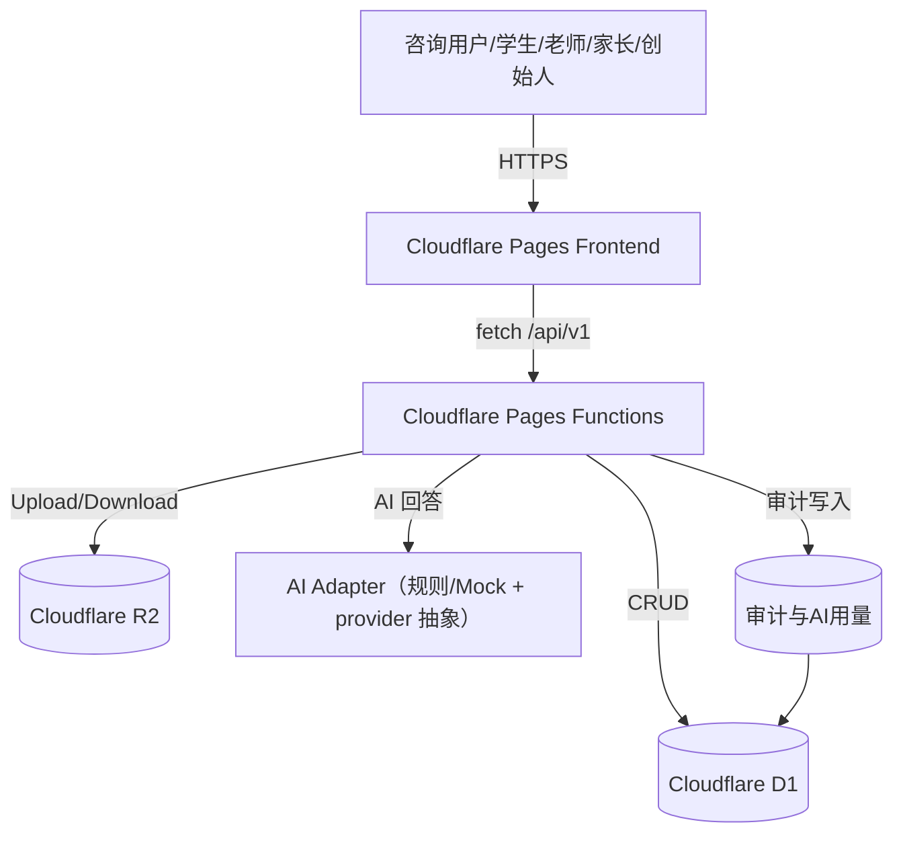

# 星伴英语（StarMate English）第一阶段架构方案（v1.0）

**项目**：星伴英语（StarMate English）  
**阶段**：Phase 1（内部可用）  
**技术栈**：React + Vite + Cloudflare Pages/Functions + D1 + R2  
**日期**：2026-06-06  
**边界声明**：第一阶段不设计数据库表结构、不过度实现 UI 细节，仅输出可直接执行架构框架与部署方案。

## 1. 架构目标

为第一阶段提供一套“可交付、可回滚、可继续扩展”的架构：

- 单仓单体式前后端边界：Web + API 在同一 Cloudflare Pages 项目；
- 统一 API 版本与契约：`/api/v1`；
- 可观测：所有关键链路具备 `request_id/trace_id`；
- 稳定优先：优先可靠性而非过度扩展（暂不构建微服务化）。

## 2. 系统边界

### 2.1 允许

- 公开咨询页：课程展示、咨询提交、试听预约、AI 回复；
- 内部学习与运营闭环：学生/老师/家长/创始人角色；
- R2 资源上传与签名下载（语音、素材）；
- 核心日志与 AI 用量/调用审计。

### 2.2 禁止（第一阶段）

- 对外公开注册与在线支付闭环；
- App/商用小程序主链路；
- 未通过接口联动的“静态动作”；
- 生产环境 mock 回填数据。

## 3. 架构视图



## 4. 目录结构（第一阶段目标结构）

```text
/docs
  - phase1-prd-starmate-english.md
  - phase1-architecture-starmate-english.md
  - openapi-v4.1.yaml
  - ui-control-api-field-map.csv
  - phase1-implementation-plan-starmate-english.md（可选）
/src
  - main.jsx
  - app/               # 路由、角色入口壳
  - features/
      - student/
      - teacher/
      - parent/
      - founder/
      - public/
      - auth/
  - components/        # 共享展示组件
  - lib/
      - api/           # API client
      - utils/
  - styles.css
/functions
  - api/
    - v1/
      - _shared/
        - runtimeData.js
        - dbLayer.js
        - phase1Api.js
      - auth/
      - public/
      - student/
      - teacher/
      - parent/
      - founder/
      - admin/
      - ai/
/scripts
  - smoke-check.mjs
  - smoke-check.sh
  - validate-contracts.js
  - web-deliver-package.sh
wrangler.toml
```

说明：该结构用于交付阶段。数据建模文件（`schema.sql`）作为当前结构快照保存，不在第一阶段扩展新表变更。

## 5. 分层设计

### 5.1 表现层（Frontend）

- 职责：页面渲染、交互事件、跳转；
- 不写鉴权主逻辑；
- 所有交互走统一 API client。

### 5.2 应用层（Shared Service Layer）

- 统一请求封装、错误处理、分页和状态映射；
- 统一 token 注入与刷新策略；
- 所有角色共用鉴权异常处理规范。

### 5.3 接口层（Pages Functions）

- 一套网关入口：`/api/v1`；
- `_shared` 层提供鉴权、响应规范、错误码和数据库访问抽象；
- 接口按角色域分组，避免职责交叉。

### 5.4 领域服务层

- `auth`：登录、会话；
- `consulting`：线索、咨询回复、试听预约、接管；
- `learning`：任务、复盘、评分；
- `attendance`：点名、课程、课时变更；
- `operations`：驾驶舱、课程、家长支付/课时视图；
- `audit`：AI 用量、关键写操作审计。

### 5.5 基础设施层

- D1：机构与成员、课程、咨询、任务、异常、日志等持久化；
- R2：录音与素材；
- Cloudflare 平台：鉴权绑定、日志、边缘分发；
- 可选 KV：速率限制、防刷与短时状态缓存。

## 6. `/api/v1` API 分层与安全模型

- 外部公开：`/public/*`、登录相关；
- 鉴权受限：`student/*`、`teacher/*`、`parent/*`、`founder/*`；
- 管理类：`admin/*`、`institution/*` 按更高权限校验；
- 角色权限：
  - admin（平台） > founder（机构） > teacher > parent > student；
  - 任何跨角色资源访问需先检查 `institution_id` 与归属关系；
  - 所有写操作需来源角色校验 + 参数校验。

## 7. API 契约边界（第一阶段）

- 统一响应标准：`code`（`0` 为成功）+ `message` + `data`；
- 错误标准：400 参数、401 身份、403 越权、404 资源、409 冲突、500 系统；
- 关键端点：
  - 健康：`GET /api/v1/health`
  - 认证：`POST /api/v1/auth/login`
  - 学生：`/api/v1/student/today-path`、`/api/v1/student/review/*`
  - 老师：`/api/v1/teacher/students`、`/api/v1/teacher/exceptions`
  - 家长：`/api/v1/parent/children`
  - 创始人：`/api/v1/founder/cockpit`
  - 公开咨询：`/api/v1/public/leads`、`/api/v1/public/trial-bookings`

## 8. 部署与发布规划

### 8.1 环境策略

1. 本地开发：`npm run stack:start:proxy`
2. 本地验收：`npm run stack:verify`
3. 预发布：Cloudflare Pages 预览
4. 生产发布：`npm run cf:deploy`（审批后）

### 8.2 发布流程

```text
main/feature -> npm run web:build -> stack:verify -> 预发验收 -> 人工复核 -> 生产发布
```

### 8.3 回滚

- 回退最近稳定 Pages 部署；
- 检查 D1 迁移/脚本执行顺序；
- R2 对象采用保守删除策略，优先执行新建 + 灰度覆盖；
- 若有重大异常，先下线写接口再回滚部署。

## 9. 观测与运维

- 接口日志：request_id、trace_id、role、actor、resourceId；
- 关键链路告警：失败率、5xx、AI 降级频率；
- 每日巡检：`/api/v1/health` 与关键业务链路；
- 验收文档与脚本应可复用，形成“新环境一次上手”流程。

## 10. 风险与控制项

- 代理/环境变量导致本地不可达：脚本中显式处理 `NO_PROXY`；
- AI 回答不可用：规则化 fallback，返回明确失败/重试提示；
- 鉴权边界模糊：按角色域进行接口签名级校验；
- 配置漂移：通过 `.env` + `wrangler.toml` 分环境统一管理，变更记录入日志。

## 11. 交付检查清单

1. PRD 与架构同步签字；
2. `/api/v1` 接口与 `openapi-v4.1.yaml` 一致；
3. 角色权限矩阵与鉴权案例通过；
4. 关键冒烟脚本通过；
5. R2 上传/下载与 D1 读写链路可验证；
6. 页面仅消费真实接口，无虚拟按钮。

**第一阶段架构锁定后可进入执行计划生成与开发。**
